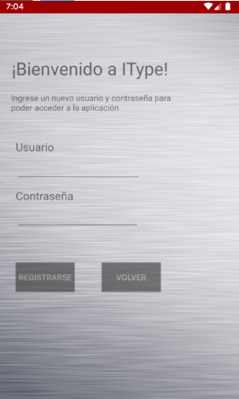
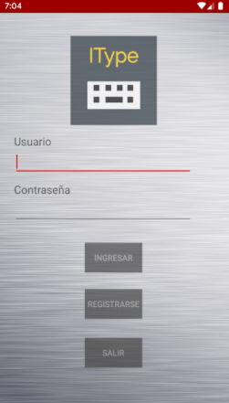
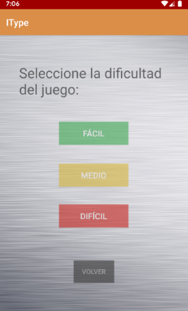
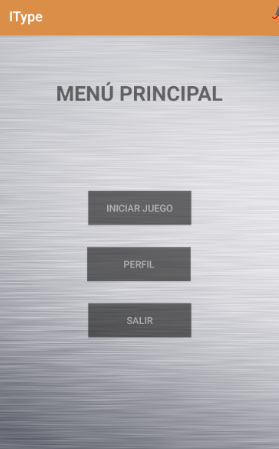
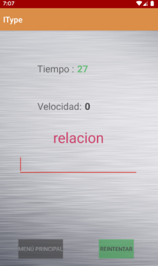
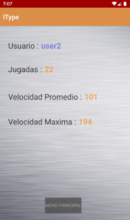
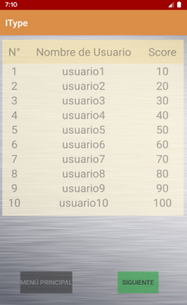
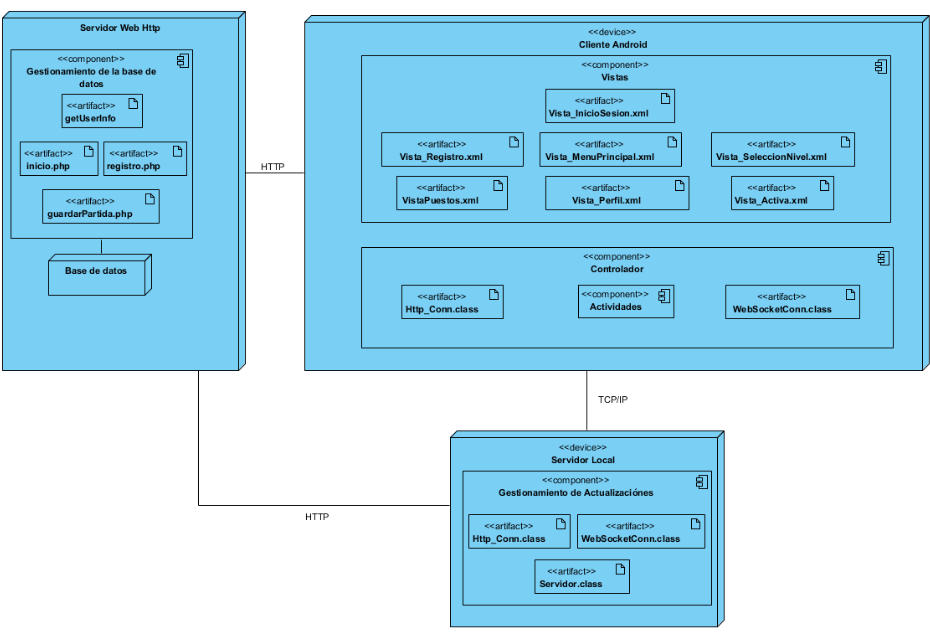

# Itype : Aplicación para pruebas de velocidad de tipeo

#### IType tiene como objetivo principal poner a prueba la velocidad de tipeo del usuario en dipositivos android. Para su evaluación, se presenta una estadística tanto global como personal.

#### Las *estadísticas globales* o “puestos” tienen como objetivo la competencia con los demás usuarios registrados, incentivando así la mejora continua del jugador.

#### La *estadística personal* o “perfil” brinda al usuario la información de todas las jugadas realizadas (velocidad promedio, máxima ,cantidad de jugadas ,etc.) para seguimiento de partidas.

## Registro e inicio :

  

## Menu :

 

## Prueba : 

 

## Resultados :

 

## Arquitectura del sistema (http web hosted sql routines & app):

